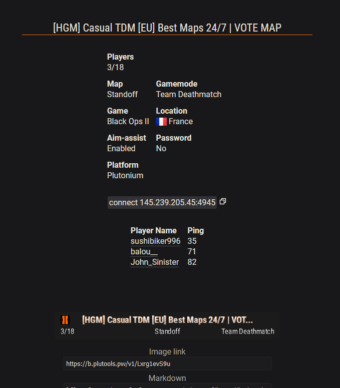

# [Plutonium](https://plutonium.pw) & [X Labs](https://xlabs.dev) Server List
### -> [Show server list](https://list.plutools.pw)

---

## Sections

#### [Links](#Links-1)
#### [Screenshots](#Screenshots-1)
#### [FAQ](#FAQ-1)
#### [API](#API-1)

---

## Links
[](https://plutools.pw/) [](https://discord.gg/SnJQusteNZ) [](https://plutonium.pw/) [](https://xlabs.dev) 

---

## Screenshots




## FAQ
#### How can I get my server removed from the website?
To have your server delisted please join the discord server or open an issue with either the hostname, ip or ip and port that you want to have removed. We may require you to prove ownership of the server.

#### I can't see the player names on the website.
Player names are currently only obtainable for Plutonium games and IW4x. If the names aren't showing for **your** IW4x server make sure to open the servers port as **both** *UDP* **and** *TCP*.

#### Why is the current round only displayed for Black Ops 2 Zombies?
For the other games the data isn't (correctly) provided by the platforms, so we have no way of knowing what round the servers are on.

#### Why is some of this code so bad?
Because I don't care, as long as it works.

---

## API
### API

#### Endpoints
```https://api.plutools.pw/v1/[endpoint]```
- ```/servers```, ```/servers/all```
- ```/servers/platform/<platform>```
  - ```<platform>``` can be ```xlabs``` or ```plutonium```
- ```/servers/game/<game>```
  - ```<game>``` can be ```iw4x```, ```iw6x```, ```s1x```, ```iw5mp```, ```t4sp```, ```t4mp```, ```t5sp```, ```t5mp```, ```t6zm``` or ```t6mp```
- ```/servers/search/<query>```
  - Searches ```identifier```, ```ip```, ```port```, ```platform```, ```game```, ```game_display```, ```hostname```, ```hostname_display```, ```map```, ```map_display```, ```gametype```, ```gametype_display```, ```description```, ```country_code```, ```country```
- ```/server/identifier/<id>```
- ```/server/address/<ip>/<port>```

#### JSON

##### Server
```
{
  identifier: '10 char long unique id: ip:port -> sha256 -> base64 -> "+" = "-", "/" = "_", "=" = "" -> substring(0, 10)'
  ip: '0.0.0.0',
  port: 28960,
  platform: 'xlabs',
  game: 'iw4x',
  game_display: 'Modern Warfare 2',
  hostname: '^2IW4x^7 Default Server',
  hostname_display: 'IW4x Default Server',
  gametype: 'war',
  gametype_display: 'Team Deathmatch',
  map: 'mp_nightshift',
  map_display: 'Skidrow',
  clients: 0,
  clients_max: 18,
  bots: 2,
  players: [
	  --- only correctly set for plutonium & iw4x (id -1) ---
	  {
		  username: 'mxve',
		  id: '-1',
		  ping: '999',
		  --- optional: ---
		  userslug: 'mxve',
		  score: 1337
	  },
	  ...
  ],
  hardcore: false,
  password: false,
  round: 0, --- only correctly set for t6zm ---
  voice: false,
  aimassist: '-1/0/1',
  description: '',
  version: '1337/1.3.7',
  country_code: 'de',
  country: 'Germany',
  cod_info: 'getinfo response: challenge\\xVfR97uB\\hostname\\^2IW4x^7 Default Server\\gamename\\IW4\\..',
  last_seen: 'date server was last seen, < 2 minutes'
}
```

##### /servers/```<endpoint>```
```
date: '2022-10-23T15:26:53.465Z',
clients_max: 1000,
clients_total: 200,
bots_total: 300,
servers_total: 1337,
servers: [
  server,
  server,
  ...
]    
```

### Server banner
```https://b.plutools.pw/v1/[endpoint]```
- ```/<identifier>```
  - ```<identifier>``` is the unique server identifier found on the API or in the server list url
  - Returns server banner png
- ```/<ip>/<port>```
  - The game servers ```<ip>``` and ```<port>```
  - Returns server banner png

### Serverlist API (legacy)
```https://list.plutools.pw/[endpoint]```
*Legacy note: Because of the way the API is implemented it should stay up-to-date with the new API and there are no plans to remove it. The new API may get extended while this one stays behind though.*
- ```/json```, ```/<game>/json```
  - ```<game>``` can be ```all```, ```iw5mp```, ```t6mp```, ```t6zm```, ```t4mp``` or ```t4sp```
  - returns matching servers
    - for each server ip, port, known & online are always returned, everything else only if the server is online.
    ```
    {
        servers: [
            {
                ip: string,
                port: integer,
                game: string,
                hostname: string,
                map: string,
                gametype: string,
                players: [
                    {
                        username: string,
                        id: integer,
                        ping: integer,
                        userslug: string
                    }
                ],
                maxplayers: integer,
                hardcore: boolean,
                password: boolean,
                bots: integer,
                voice: integer,
                description: string,
                codInfo: string,
                revision: integer,
                gametypeDisplay: string,
                mapDisplay: string,
                hostnameDisplay: string,
                known: boolean,
                online: boolean,
                date: string,
                uptodate: boolean,
                country: ISO 3166-1 alpha-2,
                aimassist: '-1' = unknown/'0' = off/'1' = on,
                identifier: string,
                round: string
            }
        ],
        date: string,
        maxPlayers: integer,
        countPlayers: integer,
        countServers: integer
    }
    ```
- ```/s/<identifier>/json```, ```/server/<ip>/<port>/json```
  - returns the matching server, see servers array above for keys
- ```/s/<identifier>/png```, ```/server/<ip>/<port>/png```
  - Preview image with server details