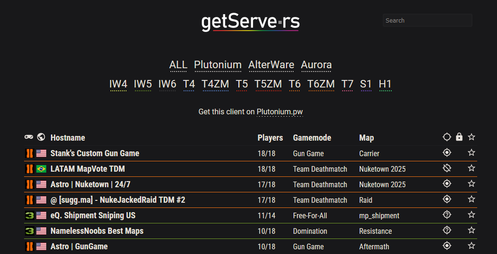

# CoD Client Server List

## -> [Show server list](https://getserve.rs)
### [Plutonium](https://plutonium.pw) | [AlterWare](https://alterware.dev) | [Aurora](https://auroramod.dev)

[](https://discord.gg/2FKcsCZgBu)



---

## API
### API
```https://api.getserve.rs/v1/[endpoint]```
- ```/servers```
  - Return all servers
- ```/servers/<platform>```
  - ```<platform>``` can be ```alterware```, ```plutonium```, ```aurora```, ```t7```
  - Return all servers on specified platform
- ```/servers/<platform>/<game>```
  - Return all servers for specified game

### Server banner
```https://b.getserve.rs/v1/[endpoint]```
- ```/<identifier>```
  - ```<identifier>``` is the unique server identifier found on the API or in the server list url
  - Returns server banner png
- ```/<ip>/<port>```
  - The game servers ```<ip>``` and ```<port>```
  - Returns server banner png

### Serverlist API (legacy)
```https://getserve.rs/[endpoint]```
*Legacy note: Because of the way the API is implemented it should stay up-to-date with the new API and there are no plans to remove it. The new API may get extended while this one stays behind though.*
- ```/json```, ```/<game>/json```
- ```/s/<identifier>/json```, ```/server/<ip>/<port>/json```
  - returns the matching server, see servers array above for keys
- ```/s/<identifier>/png```, ```/server/<ip>/<port>/png```
  - Preview image with server details